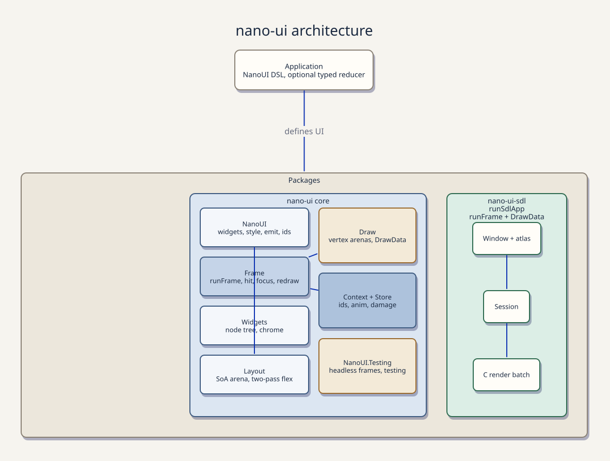

<div align="center">

# nano-ui

**A purely functional, immediate-mode GUI toolkit for Haskell**


Applications describe their user interface as a pure function of state.<br/>
The engine evaluates layout, focus, input handling, animations, and damage tracking every frame, returning a batched draw list to the host renderer.

[Features](#features) • [Quickstart](#quickstart) • [Packages](#workspace-packages) • [Architecture](#architecture--rendering-pipeline) • [Layout & Components](#layout--component-catalog) • [Building](#building--running-demos)

</div>

---

## Features

- **Pure Declarative UI**: State drives the interface. Zero retained DOM nodes, zero mutable widget handles, and zero callback chains.
- **Backend Agnostic**: Swap host packages to render inside hardware-accelerated SDL3 windows or lightweight RGFW windows without touching your UI code.
- **Dual State Architecture**: Choose local component hooks (`useInt`, `useState`) or pure Elm-style reducers (`buttonEmit`, `runSdlAppReduce`) for app-wide state.
- **Damage-Tracked Rendering**: Skips redrawing idle frames when state remains unchanged, minimizing CPU usage.
- **AVX2 SIMD Acceleration**: Low-level C kernels (`-mavx2`) accelerate tree layout solving, damage union math, and vertex buffer generation.
- **Headless Testing**: Test component behavior deterministically frame-by-frame and inspect layout output headlessly.

---

## Quickstart

### Local Hooks Pattern

Transient UI state (such as counter values, text inputs, or toggle flags) lives inside component context. Notice how `button` directly returns `Bool`, working seamlessly with `whenM`:

```haskell
import qualified Data.Text as T
import NanoUI
import NanoUI.Backend.Sdl (SdlOptions (..), defaultSdlOptions, runSdlApp)

main :: IO ()
main = runSdlApp defaultSdlOptions { sdlAppShouldQuit = inputKeysElem KeyEscape . inputKeys } counterApp

counterApp :: NanoUI ()
counterApp = do
  (count, setCount) <- useInt 0
  columnWith (grow defaultLayout) $ do
    heading "Local Hooks Counter"
    row $ do
      whenM (button "-") (setCount (count - 1))
      label (T.pack (show count))
      whenM (button "+") (setCount (count + 1))
```

### Immediate-Mode Mental Model

`nano-ui` follows the classic, immediate-mode GUI philosophy: **declaring a widget executes its hit-test, layout, and event logic immediately within the frame.**

1. **Direct Boolean Actions (`button`, `menuItem`)**:
   Standard interactive widgets return `Eff es Bool` indicating whether they were clicked during this frame:
   ```haskell
   whenM (button "Save") saveDocument
   whenM (menuItem "Open...") openDocument
   ```
   `whenM`, `unlessM`, and `ifM` are re-exported directly from `NanoUI` so you don't need additional imports.

2. **Inspecting Geometry & Metadata (`button'`, `menuItem'`)**:
   When you need the widget's bounding box, hover state, or response metadata (for floating popups, tooltips, or context menus), use the primed variants which return `Eff es Response`:
   ```haskell
   saveBtn <- button' "Save"
   tooltip saveBtn "Save current file (Ctrl+S)"
   ```

3. **Custom Layout Sizing (`buttonWith`, `sliderWith`)**:
   Style and layout modifiers can be applied directly using `*With` combinators:
   ```haskell
   whenM (buttonWith (minW 120 . fillH) "Large Action") doWork
   ```

### Elm Architecture Pattern (Emitters & Reducers)

For global application state, widgets emit typed messages processed by a pure update function:

```haskell
import qualified Data.Text as T
import NanoUI
import NanoUI.Backend.Sdl (SdlOptions (..), defaultSdlOptions, runSdlAppReduce)

data Msg = Increment | Decrement deriving (Eq)

update :: Msg -> Int -> Int
update Increment n = n + 1
update Decrement n = n - 1

view :: Int -> NanoUI ()
view n = columnWith (grow defaultLayout) $ do
  heading "Elm-Style Counter"
  row $ do
    buttonEmit "-" Decrement
    label (T.pack (show n))
    buttonEmit "+" Increment

main :: IO ()
main = runSdlAppReduce defaultSdlOptions { sdlAppShouldQuit = inputKeysElem KeyEscape . inputKeys } update 0 view
```

### Headless Testing

Run UI code headlessly in unit tests without initializing display servers or windowing backends:

```haskell
import NanoUI
import NanoUI.Testing (newContext, drawCmdCount, runFrame)

testCounter :: IO ()
testCounter = do
  ctx <- newContext
  let input = emptyInput { inputWindowSize = Size 80 24 }
  (_, _, drawData, _) <- runFrame ctx input counterApp

  -- Inspect the batched draw list directly
  print (drawCmdCount drawData)
```

> [!TIP]
> Headless execution allows full CI/CD test coverage of UI logic, event routing, and state transitions without headless X11 servers or GPU dependencies.

---

## Workspace Packages

The repository is organized as a Cabal multi-package workspace:

| Package | Role | Target Host | Key Modules |
| :--- | :--- | :--- | :--- |
| **`nano-ui`** | Core Engine | Core DSL, flex layout, damage tracker, test harness | `NanoUI`, `NanoUI.Testing` |
| **`nano-ui-sdl`** | Desktop Window | Hardware-accelerated SDL3 & SDL3_ttf host | `NanoUI.Backend.Sdl` |
| **`nano-ui-rgfw`** | Standalone Window | Self-contained RGFW host with Cozette bitmap font | `NanoUI.Backend.Rgfw` |
| **`nano-ui-rgfw-bindings`** | C Bindings | Low-level C FFI bindings for RGFW | `NanoUI.Rgfw.Native` |
| **`nano-ui-diagrams`** | Graphics Bridge | Vector graphics and plotting via `diagrams-lib` | `NanoUI.Diagrams` |
| **`nano-ui-form`** | Form Framework | Composable type-safe formlets built on `ditto` | `NanoUI.Form` |
| **`nano-ui-demo`** | Showcases | Multi-backend showcase and profiling suites | `nano-ui-sdl-demo`, `nano-ui-sdl-profile` |

---

## Architecture & Rendering Pipeline

`nano-ui` splits UI computation into distinct, allocation-efficient execution stages:



1. **State & Layout Pass**: Resolves layout trees and computes element bounding boxes.
2. **Damage Culling Pass**: Compares element bounds against damage regions to prune redrawing.
3. **Command Batching**: Assembles vector geometry and text quads into pinned vertex buffers.
4. **Host Presentation**: Transfers draw lists to SDL3 or RGFW render targets.


---

## Layout & Component Catalog

### Flex Containers & Layout Modifiers

| Category | Functions / Operators | Description |
| :--- | :--- | :--- |
| **Containers** | `column'`, `row'`, `grid'` | Vertical, horizontal, and grid flex layout containers |
| **Viewports** | `scrollArea`, `scrollArea2D` | Scrollable areas with automatic scrollbar gutters |
| **Workspaces** | `paneGrid`, `splitPane` | Resizable dockable split panes and window layouts |
| **Overlays** | `window`, `modal`, `popup` | Floating movable windows and modal dialog overlays |
| **Sizing Modifiers** | `grow`, `fillW`, `fillH`, `fixedWH` | Expandable, parent-filling, or fixed dimension constraints |
| **Padding & Spacing** | `padAll`, `padXY`, `gap` | Inner container padding and child item spacing |
| **Alignment** | `alignMid`, `alignCenter`, `alignTop` | Flex alignment controls across x and y axes |

### Built-in Components

- **Input Controls**: `button` / `button'` / `buttonWith`, `checkbox`, `slider` / `sliderWith`, `textInput`, `textArea`, `comboBox`, `colorPicker`, `radioFieldset`, `knob`, `toggleSwitch`
- **Data Display**: `label`, `heading`, `sparkline`, `progressBar`, `circularProgress`, `table`, `tree`, `kv`, `card`
- **Navigation & Overlays**: `tabs`, `tabBar`, `menuItem` / `menuItem'`, `contextMenu`, `tooltip`, `modal`, `window`, `popup`, `toolbar`, `separator`, `spacer`
- **Control Flow**: `whenM`, `unlessM`, `ifM` (monadic branch combinators re-exported for immediate mode)
- **Custom Painting**: `image`, `drawing`, `canvas`, `customWidget` (direct primitive quad, gradient, and path rendering)
- **Animations**: `animate`, `animateEase`, `animateToSpring`, `pulse` (configurable spring dynamics)

---

## Building & Running Demos

For the source map, focused test commands, and extension conventions, see the
[development guide](docs/development.md).

### Build Matrix & Prerequisites

| Backend | Cabal Flag | System Dependencies | Supported OS |
| :--- | :--- | :--- | :--- |
| **SDL3 Window** (`nano-ui-sdl`) | `-fsdl` | `sdl3 >= 3.2`, `sdl3-ttf >= 3.2`, `pkg-config` | Linux, macOS, Windows |
| **RGFW Window** (`nano-ui-rgfw`) | None (Default) | C compiler (Bundled RGFW) | Linux, macOS, Windows |
| **SIMD Acceleration** | `-fsimd` | x86-64 CPU with AVX2 support | x86-64 |

### Cabal Commands

```bash
# Build all workspace packages
cabal build all

# Run full test suite
cabal test all

# Launch lightweight RGFW window demo
cabal run nano-ui-rgfw-demo

# Launch the SDL3 notepad example (menu bar, file open/save, multi-line editor)
cabal run nano-ui-sdl-notepad

# Launch the minimal PTY terminal example (Linux/macOS)
cabal run nano-ui-sdl-terminal

# Launch hardware-accelerated SDL3 demo (requires -fsdl flag)
cabal run -fsdl nano-ui-sdl-demo

# Launch performance profiling suite
cabal run nano-ui-profile
```

### Terminal example

[`SdlTerminal.hs`](packages/nano-ui-demo/app/SdlTerminal.hs) attaches `/bin/sh -i`
to a real controlling PTY. The Haskell `streaming` library folds nonblocking PTY
chunks into a pure screen state (`S.unfoldr` → `S.fold`) and drives the window
(`S.iterateM` → `S.mapM_`). Keyboard input goes directly to the PTY, including
Ctrl+C/D/Z; the shell and terminal driver handle editing and job control.

The golfed emulator is fixed at 80×24 with a monospace font, UTF-8 decoding,
wrapping, basic ANSI cursor movement and erasing, and 2,000 lines of scrollback.
Use the mouse wheel or touchpad to browse history; typing returns to the live
prompt. New output preserves your reading position. It supports 16 ANSI colors,
bold and inverse text, and advertises `TERM=ansi`; 256-color/truecolor sequences
are consumed without changing the pen. There is no wide-character layout or
full VT100 compatibility. Close the window or exit the
shell to quit. The five-line C shim only sets the PTY size.

Run parser, color, scrollback and PTY regression checks with
`cabal test nano-ui-terminal-test --test-show-details=direct`.

### Reproducible Nix Flake

A Nix Flake is provided to configure GHC 9.14, Cabal, HLS, and SDL3 automatically:

```bash
# Enter development shell with all native dependencies configured
nix develop

# Run the SDL3 window demo directly
nix run .#nano-ui-sdl-demo

# Run all flake checks and test suites
nix flake check
```

---

## License

Distributed under the [MIT License](LICENSE).
