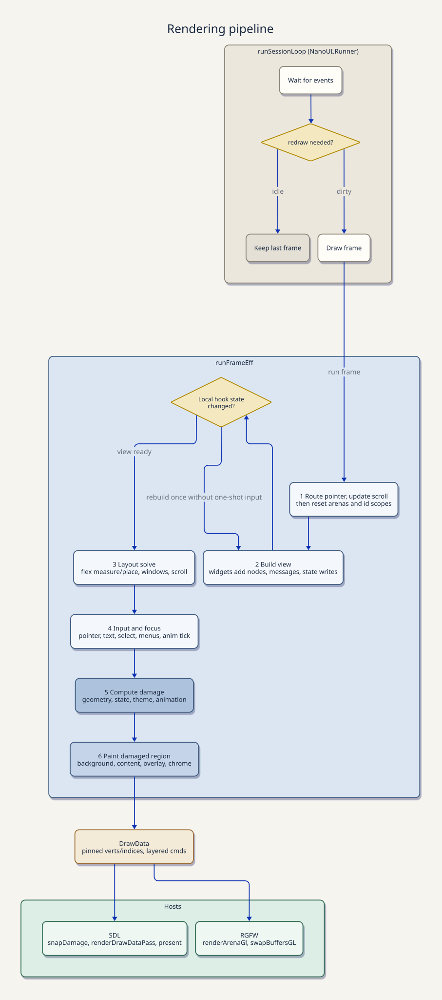

# Development

## Setup

You need GHC 9.14 and Cabal. `nix develop` provides both, along with SDL3,
SDL3_ttf, and pkg-config.

`nano-ui-form` depends on ditto 0.5, which `cabal.project` builds from a
checkout at `../ditto`. Clone [ditto](https://github.com/goolord/ditto) next to
this repository before building.

## Building and testing

```sh
cabal build -j1 all
cabal test -j1 all
```

Keep to one job. Several optimising GHC processes at once can exhaust memory on
a desktop machine; if you need a hard limit, `GHCRTS=-M4G cabal build -j1 ...`
fails the build instead of swapping.

| Test suite | Covers |
| --- | --- |
| `nano-ui-test` | Widgets, layout, input, focus, damage, and drawing, run headlessly frame by frame |
| `text-buffer-spec` | The multi-line text buffer |
| `nano-ui-inspection` | Compile-time checks that the vertex writers inline without dictionaries or tuples |
| `nano-ui-rgfw-test` | RGFW input translation, the glyph atlas, and frames drawn by a software rasteriser kept in the test suite |
| `nano-ui-font-search-test`, `nano-ui-font-effects-test` | SDL font discovery, measurement, and handle lifetimes |
| `nano-ui-diagrams-test` | Diagram conversion, tessellation, and charts |
| `nano-ui-form-test` | Form scopes, validation, reset, and submission |
| `nano-ui-terminal-test` | The terminal demo's escape-sequence parser and PTY |

Run one suite with `cabal test nano-ui-test --test-show-details=failures`.

The headless suites don't exercise native presentation. After changing a
backend, run its demo. The SDL demo, notepad, and log viewer each have a
self-test that drives the app in a hidden window and exits:

```sh
cabal run nano-ui-sdl-demo -- --selftest
cabal run nano-ui-sdl-notepad -- --selftest
cabal run nano-ui-sdl-logs -- --selftest
```

The RGFW backend has its own demo, `cabal run nano-ui-rgfw-demo`.

`scripts/record-demo.sh [OUT]` re-records the README's tour of the SDL demo
into `OUT/demo.mp4`. It drives the demo in a hidden window (`--record DIR`,
in `SdlRecord`), so rerun it after changing a widget the tour visits. It
needs ffmpeg. The video is not committed: drop it into a GitHub issue or PR
comment box and put the `user-attachments` URL GitHub gives back in
`README.md`.

### Flags

`cabal.project` turns on these flags:

- `nano-ui-sdl:sdl` builds the SDL backend. `nano-ui-demo` and `nano-ui-form`
  have their own `sdl` flag for the executables that need it.
- `nano-ui-sdl:simd` compiles the draw-batch culler with AVX2. It only applies
  on x86-64, and the resulting binary needs an AVX2 CPU. To build without it,
  add this to `cabal.project.local`:

  ```cabal
  package nano-ui-sdl
    flags: -simd
  ```

## Repository layout

| Path | Contents |
| --- | --- |
| `packages/nano-ui/lib/NanoUI.hs` | The public API and its documentation |
| `NanoUI/Widgets/` | One module per widget family |
| `NanoUI/Emit.hs` | Reducer-style widgets |
| `NanoUI/Monad.hs`, `NanoUI/Id.hs` | The `Ui` effect, widget ids, and keys |
| `NanoUI/Hooks.hs`, `NanoUI/Store.hs`, `NanoUI/Context.hs`, `NanoUI/Context/` | Widget state and the frame context |
| `NanoUI/Layout/` | Layout storage and the solver |
| `NanoUI/Frame.hs`, `NanoUI/Frame/` | Per-frame input, focus, painting, and damage |
| `NanoUI/Draw.hs`, `NanoUI/Draw/` | Vertex arenas and the draw list |
| `NanoUI/Runner.hs` | The event loop the backends share |
| `NanoUI/Testing.hs`, `NanoUI/Testing/` | The headless test harness |
| `packages/nano-ui-sdl`, `packages/nano-ui-rgfw` | Window backends |
| `packages/nano-ui-rgfw-bindings` | RGFW bindings, with the C source |
| `packages/nano-ui-diagrams`, `packages/nano-ui-form` | Charts and diagrams, and forms |
| `packages/nano-ui-demo` | Example applications |
| `scripts/` | Font subsetting (`prune_inter.py`, `prune_cozette.py`) and profiling helpers |

Paths in the first column from the second row to `NanoUI/Testing/` are under
`packages/nano-ui/lib`.

## How a frame works

The README's "How it works" section lists the steps of a frame, and
[rendering-pipeline.svg](rendering-pipeline.svg) (source:
`rendering-pipeline.d2`) draws them with the backend loop around them.



## Conventions

- Public widgets follow the rules in the `NanoUI` module documentation: the
  result comes first, a primed variant adds the `Response`, inputs are
  controlled, and layout arguments are modifiers.
- A controlled input adopts the caller's value with `adoptStoreInt`,
  `adoptStoreFloat`, or `adoptStoreText`, and records what it returned with the
  matching `recordStore*`. New inputs should use the same pair, so edits made
  between frames survive a caller that passes the previous result back.
- Widget state in the store is read and written through the slot functions of
  `NanoUI.Store` (`findSlot fieldInt 0 key store`,
  `insertSlot fieldPoint key p . deleteSlot fieldInt key`), not through the
  maps. They compile to the record code they stand for. A widget that
  publishes state every frame writes it with `writeSlots`, which skips the
  write, and the store diff behind it, when nothing changed.
- Local state goes through `NanoUI.Hooks`. Keyboard handling checks
  `NanoUI.Widgets.Behavior.keyboardFocused` first, so disabled widgets and
  modals are respected.
- Damage is part of correctness: a state change can need a follow-up frame
  without any new input. Add a test when you change it.
- Backend-independent event sequencing lives in `NanoUI.Runner`. A backend
  supplies a `SessionDriver` for event translation and presentation.
- Write code inline. Add a function when it removes real duplication or names a
  computation that isn't obvious.
- Add tests for observable behaviour. Core cases live in
  `packages/nano-ui/test/integration/Cases/` and are registered in `Main.hs`
  and the package's Cabal file. `NanoUI.Testing.Harness` builds pointer
  frames (`pressAt`, `holdAt`, `releaseAt`, `clickPair`), finds spans
  (`spanRect`, `spanRectOf`) and warms views up; a test that needs a rect or
  a span to go on takes it with `assertJust`, which counts a failure when it
  is missing.
- Format Haskell with the repository's `fourmolu.yaml`.

## Performance

Packages build at Cabal's default `-O1`. The core compiles in under a minute
that way, against more than four minutes at `-O2`, and the headless profiler
runs slightly faster. To profile a release build, add this to
`cabal.project.local`:

```cabal
package nano-ui
  optimization: 2
```

- Keep `INLINE` for small bodies and helpers inside per-vertex, per-glyph, or
  per-node loops. A large inlined body slows every importer's build for little
  runtime gain.
- `-fspecialise-aggressively`, `-flate-specialise`, `-fmax-worker-args=32`, and
  `-funbox-strict-fields` made the core about 12% slower on the headless
  profiler as well as slower to build. Leave them off.
- A custom widget without a `widgetContent` key has its ops rebuilt and
  compared every frame, since only building them shows whether what it draws
  changed. That is right for a handful of ops and wasteful for thousands: give
  an op-heavy drawing a key covering everything it reads, and an unchanged key
  skips the rebuild and the repaint. `contentKey` hashes numbers into one.
- `bytes allocated` from `nano-ui-profile -- <scene> +RTS -s` is the same on
  every run, so a change to per-frame code that should cost nothing leaves it
  unchanged to the byte. Check it after restructuring such code: the order of
  composed store writes, for one, decides what their thunks capture.
- Compare compile times per module with
  `cabal build <target> --ghc-options="-ddump-timings -ddump-to-file"`.

### Profilers and benchmarks

| Command | Runs |
| --- | --- |
| `cabal run nano-ui-profile -- <scene> +RTS -s` | Headless frames. Scenes: `widgets` (the default), `canvas` (an op-heavy unkeyed custom widget), `canvas-keyed` (the same drawing with a content key), `textarea` (typing into a 100,000-line `textAreaDocument`), `textarea-text` (the same through the `Text` API, which joins the document on every edit), and `svg` (icon rasterization) |
| `cabal run nano-ui-sdl-profile` | The SDL demo's UI in a hidden window: the full demo, each tab, widget microbenchmarks, and scaling |
| `cabal run nano-ui-rgfw-profile` | The RGFW demo's frame loop on the OpenGL path in a hidden window |
| `cabal run nano-ui-sdl-anim` | Tween and spring animations in an SDL window, for checking animation pacing by eye |
| `cabal run nano-ui-sdl-idle -- <scene> [hidden]` | A window that should cost nothing while it is left alone. Scenes: `static`, `focus`, `wake`, `spinner`, `clock`, `type`, and `startup`. `hidden` keeps it off screen, where no pointer can disturb it |
| `cabal bench nano-ui-id-bench` | Widget id generation; fails if a frame of ids allocates |
| `cabal bench nano-ui-sdl-bench` | `runFrame` and SDL drawing for small, medium, and large UIs |

`scripts/profile/` has helpers for cost-centre profiles and for timing the SDL
demo's real event loop.

### Idle cost

A window nobody is touching should use no CPU and no GPU: the session loop
blocks in the backend's event wait, and the process makes no context switches.
Anything that keeps it running shows up as a fraction of a percent in Task
Manager that never goes away, and on a laptop as battery.

Set `NANO_LOOP_TRACE` to see what the loop is doing. About once a second while
it runs, it prints to stderr the time covered, how many passes it made, how
many drew, and why: `A` an animation, `D` a dirty context, `R` a window redraw
request, `T` a timed wake or a debug readout refresh, and `-` for a pass
caused by input. An idle window prints nothing, and the first line after a
quiet spell covers all of it.

```sh
NANO_LOOP_TRACE=1 cabal run nano-ui-sdl-idle -- spinner
```

Three rules keep a view idle:

- Nothing may run frames by itself except an animation that is on screen.
  `keepAnimating` lasts as long as it keeps being called, so call it from the
  widget it animates and not from somewhere that is always built.
- A view that changes on a schedule (a clock, a debounce, a held button's
  repeat) asks for its next frame with `wakeAfter`, or `requestWakeAt` from
  code holding a `Context`. Each frame starts with no wake pending and the
  widgets still built ask again, so one that is gone stops costing anything.
  Do not mark the context dirty every frame to get there: a dirty context is
  redrawn at once, which is a busy loop.
- A background thread that changes what the view reads wakes the loop through
  `ctxWakeLoop`. The wake runs one frame, and the frame's damage decides what
  is presented, so waking for a change that is not on screen is cheap. A
  change damage cannot see, such as new pixels under a registered image id,
  needs `damageFull`.

To measure a process, read its cycle time (`QueryProcessCycleTime` on
Windows) and its threads' context switch counts over ten seconds or so. CPU
time from the process table is counted in scheduler ticks of 15.6 ms and
misses a loop of short wakes almost entirely. A percentage in Task Manager is
of the whole machine, so 0.4% on 32 logical processors is an eighth of a
core.

## Releasing

Run `cabal check` in each package directory, then `cabal sdist all`, and build
the archives from a clean directory. That catches files missing from
`extra-source-files`, such as C headers and bundled fonts.
